# LittleLemon

the Virtual env is set using python3 -m venv venv
so please use this command to run the virtual env - 

<pre>
source venv/bin/activate
</pre>

or create a new virtual envronment using -
<pre>
python3 -m venv venv
source venv/bin/activate
</pre>

Install all the following dependencies - 
<pre>
pip3 install django
pip3 install djangorestframework
pip3 install djangorestframework-xml
pip3 install djoser
pip3 install mysqlclient
</pre>

Please run the following commands to run the program - 
<pre>
python3 manage.py makemigrations

python3 manage.py migrate
   
python3 manage.py runserver 
</pre>

once the website opens you can use it

you can use /api/bookings/ to access booking or restaurant/booking/

also you can use  restaurant/menu/ or restaurant/menu/<Item no> 

To be able to create users, you can create a superuser and then create other users. 
This also allows you to add and delete menu -

<pre>
python3 manage.py createsuperuser   

then go to -> http://127.0.0.1:8000/admin/
</pre>

To be able to access the reservation (MySQL) you can use following commands-
<pre>
Set up MySQL

mysql -u root -p    

and manage the reservations database
</pre>

## User Manual

1. Home Page
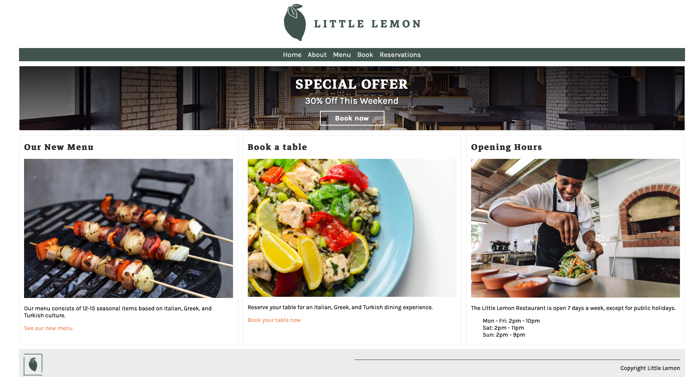
2. About
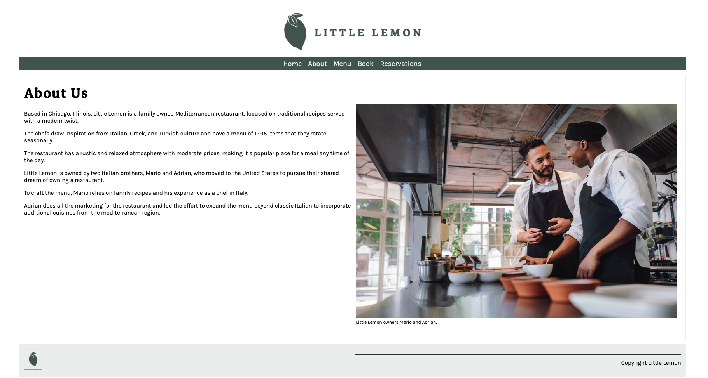
3. Menu
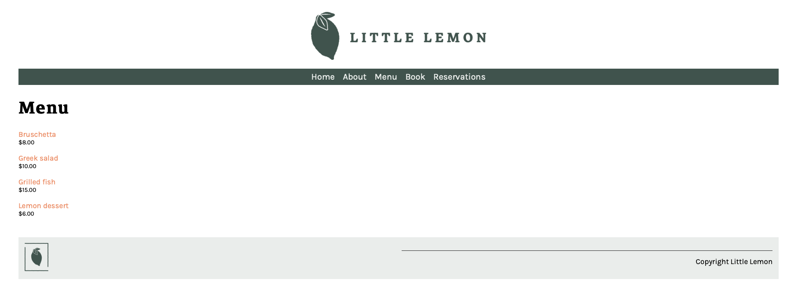
* Menu Item Page 
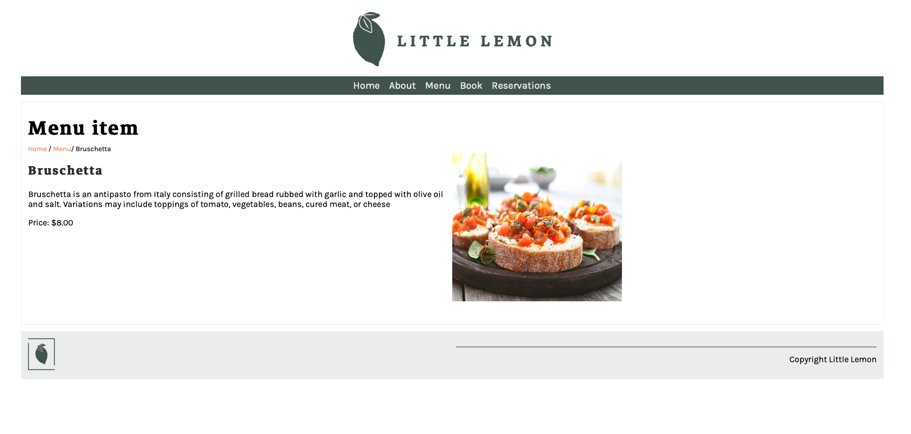
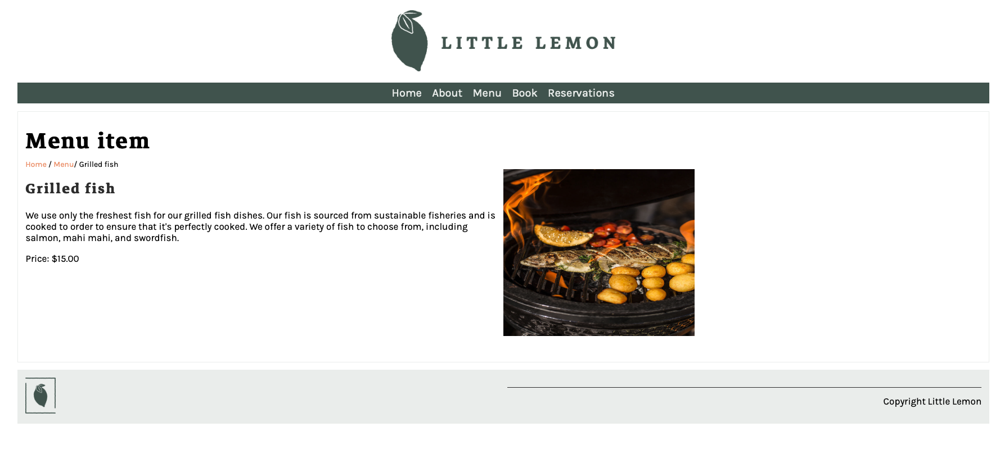
4. Book
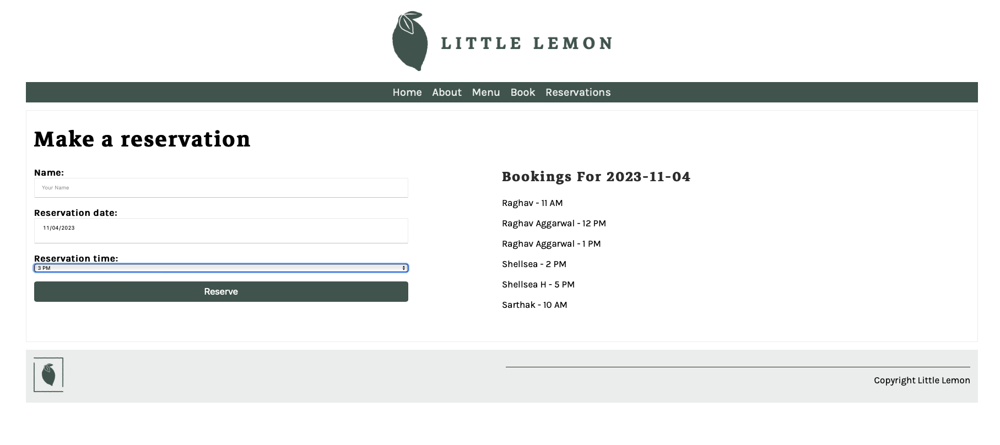
* Added functionality to not double book 
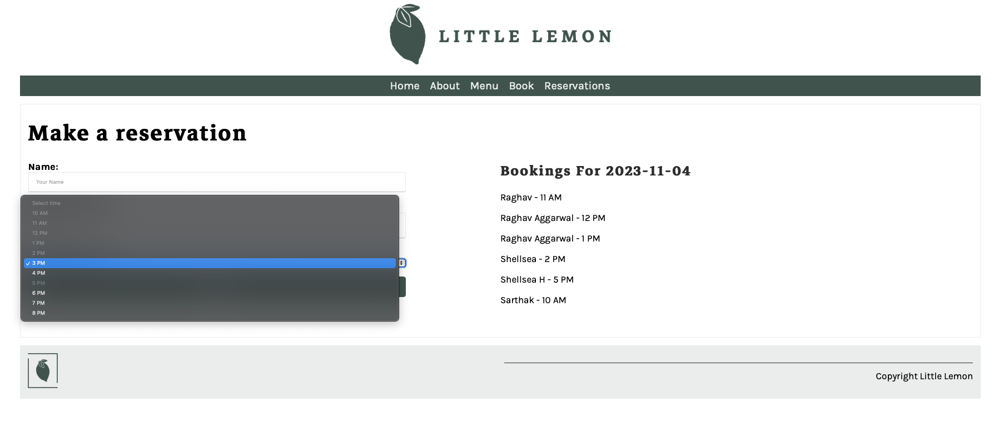
5. Reservations
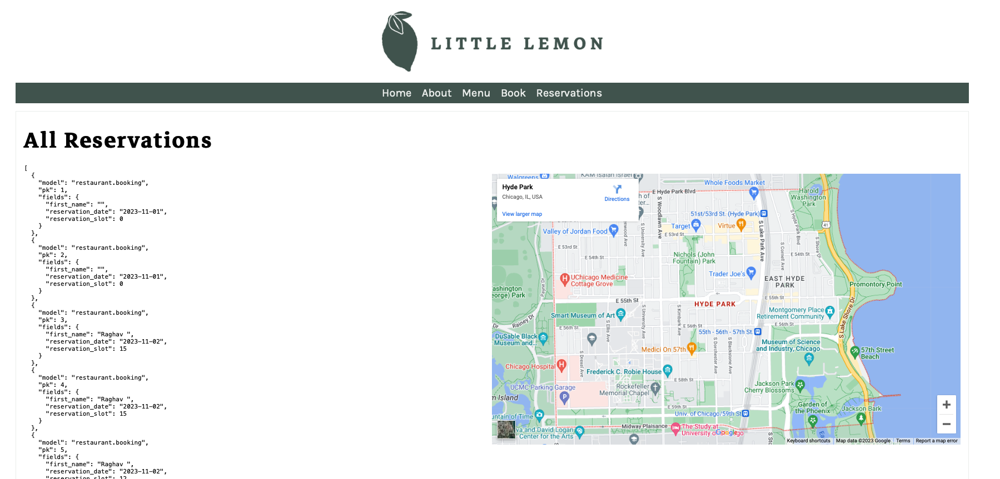
6. ADMIN
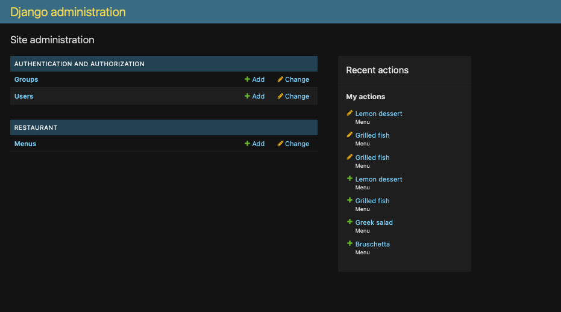
* UPDATE MENU
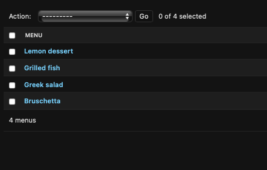
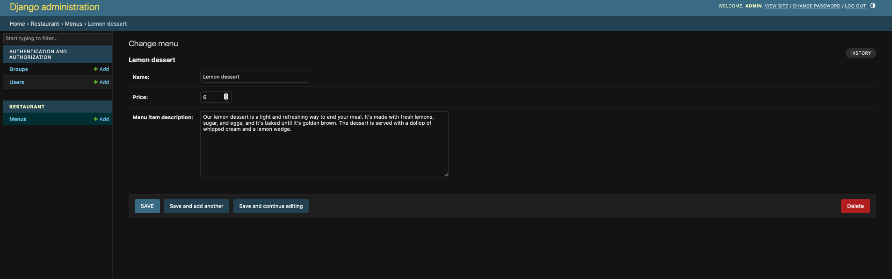